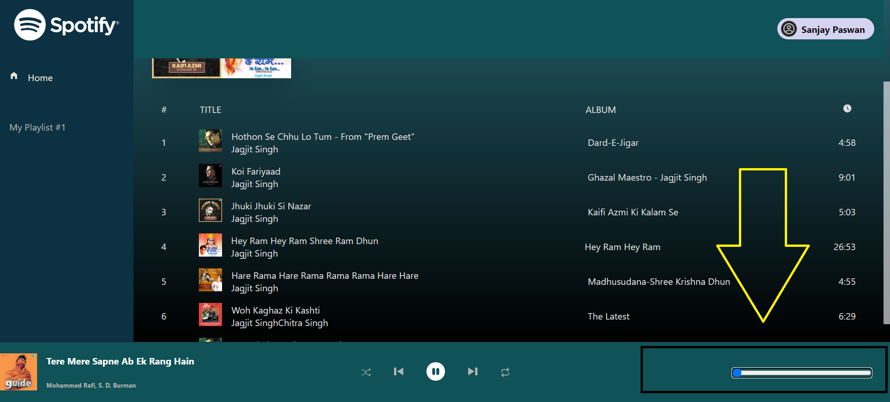

# Billfree Reactjs Test

#### Git Clone Project URL :

command `git clone https://github.com/paswans05/billfree-reactjs-test.git`

#### `npm install or npm i`

## Available Scripts

In the project directory, you can run:

#### `npm start`

Runs the app in the development mode.\
Open [http://localhost:3000](http://localhost:3000) to view it in your browser.

The page will reload when you make changes.\
You may also see any lint errors in the console.

## Using Libraries

#### `react-toastify`: "^9.1.3",

React-Toastify is a free, popular, and MIT-licensed package that you can use to add toast notifications to your React application. There are several other similar toast libraries in the React ecosystem.

#### `redux`: "^5.0.1",

The Redux store is the main, central bucket which stores all the states of an application. It should be considered and maintained as a single source of truth for the state of the application.

#### `redux-debounced`: "^0.5.0",

Debounce allows you to discard a fast paced action from updating your state until a certain period of time passes after the last action is fired.

#### `redux-thunk`: "^3.1.0",

Redux Thunk middleware allows you to write action creators that return a function instead of an action. The thunk can be used to delay the dispatch of an action, or to dispatch only if a certain condition is met. The inner function receives the store methods dispatch and getState as parameters.

#### `styled-components`: "^6.1.8",

Styled-components is a library that allows you to write CSS in JS while building custom components in Reactjs . There are multiple options you can go with to style a React application. But the CSS in JS technique is good approach, where you write the CSS code right in the JavaScript file

#### `React Start Time 30s to 1 minute wait before starting`

#### First Page for login with spotify account

## Start Step For Spotify Developer Account

This tutorial will help you to make your first Web API call by retriving an artist's metadata. The steps to do so are the following:

### Spotiy Account to create an App and following this step. :

#### `https://developer.spotify.com/documentation/web-api`

#### When the app has been created in Spotify. The Client Secret view can be found behind the Client Secret link.

# End Step For Spotify Developer Account

## On the login page, enter your client ID in the field client_id which is found in your Spotify developer account.

#### client_id = "7e85343fbabd4a--------00dac"

#### Path : `billfree-reactjs-test/src/components/Login.js`

## Login in app

# Note : To run Spotify Developer API, you will have to open Spotify in a new tab. Because device id is also required in API.

## `You have to pay a premium to run the Spotify API player, only then your song can be played.`

### Step 1: Login in Spotify play new tab

### Step 2: connect with spotify

### Step 3: Login Spotify with agree in down

### Step 4: Play list

### Step 5: Volume Down

### Step 6: Volume Up

### Step 7: Song Next

### Step 8: Song Previous

### Step 9: Song Pause

